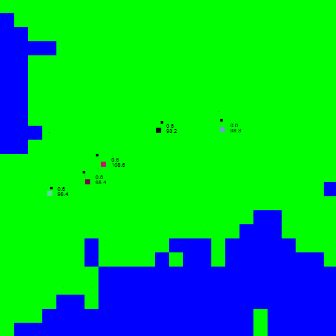
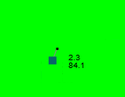

# evonet-js
A JavaScript translation of https://github.com/pampersrocker/EvoNet.

## Usage
Just open the `index.html` file in your browser. If you want, you can play
around with the constants in `js/config.js`.

Be aware that many creatures need lots of memory.

## Explanation
This is a simple simulation of the evolution. Creatures are spawned randomly on
a map which consists of land and water. Positions outside the map are considered
water.

The world the creatures live in.

### Food
Land next to water is fertile, so food can grow on it. Once a tile has reached a
certain food value, the neighbouring tiles are also fertile.

### Creatures
Every creature consists of its body and its feeler. Its has an age and energy
value. When the creature is born, its age is 0; its energy is a certain value
specified in the config file. This picture shows what creatures look like:

The upper number shows the current age of the creature (2.3), the lower one
shows its energy (84.1).

Creatures lose a certain amount of energy every tick, depending on their age.
Young creatures lose few energy, older creatures lose more. Every action a
creature performs costs energy.

A creature can perform these actions:
* rotate (costs energy depending on the angle)
* move forward (costs energy depending on the distance)
* eat (gives energy depending on how much the creature eats)
* give birth to a child (costs the child's start energy)

#### How creatures decide what to do
Every creature has a neural network, representing its brain. This neural network
decides what the creature does. Every tick, its input neurons are updated with
the values the creature senses. The creatures can feel
* the food value at their body tile
* the food value at their feeler tile
* if their body tile is land or water
* if their feeler tile is land or water
* their own energy
* their own age

#### Neural networks
A neural network consists of neurons that are ordered in layers. Every neuron in
a layer has a connection to all neurons of the previous layer. These connections
are called synapses.

The very first layer is called the input layer, the last layer is the output
layer.

#### Mutation
Mutation is the key element of evolution. Whenever a creature reproduces itself,
the child is slightly mutated.

This mutation happens by randomly changing the weights of the synapses.
